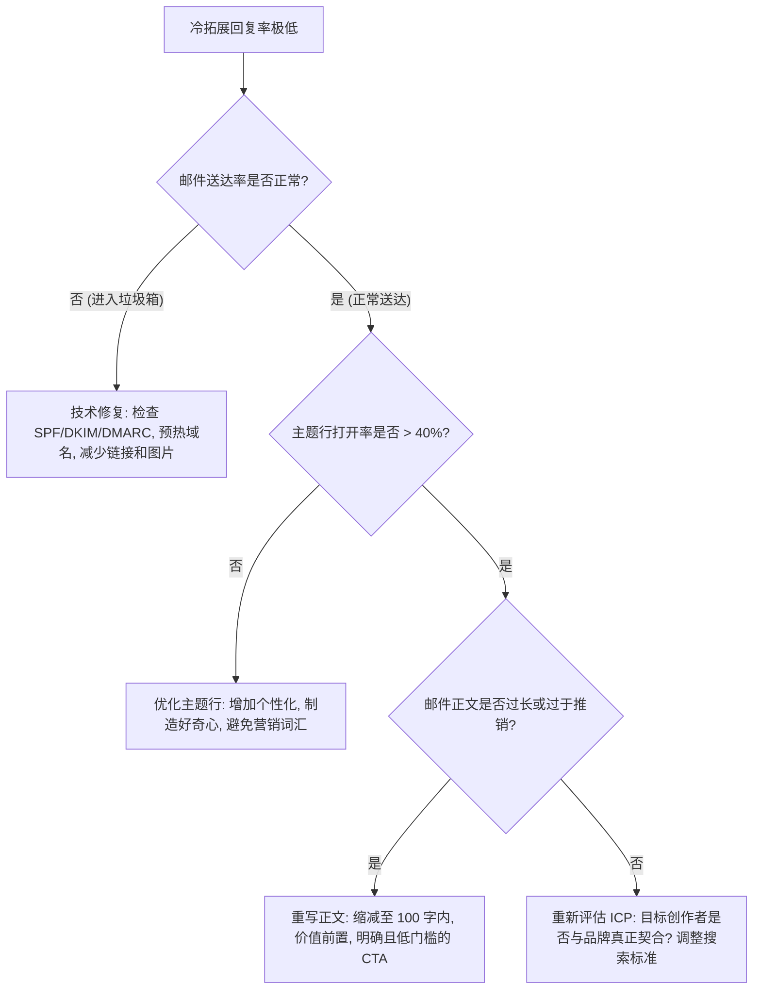
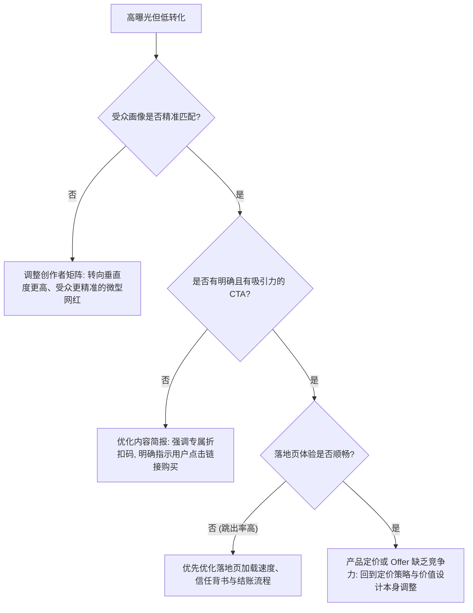
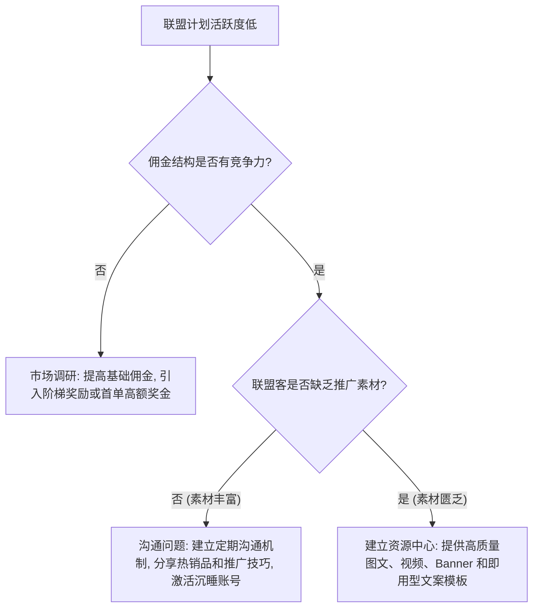

# 诊断系统

> 本文件为当前生效的模块参考资料，供执行时按需加载；用于扩展达人合作与联盟转化中的结构化诊断模式与恢复路径。若与当前模块 `SKILL.md` 或 `_system/` 全局协议冲突，以系统级规则为准。

## 诊断体系：解决合作与转化瓶颈

> **核心目标**：通过结构化的决策树，快速定位网红营销和联盟计划中出现的问题，并提供可执行的恢复方案。

### 诊断模式 1：冷拓展回复率极低 (< 2%)



### 诊断模式 2：创作者内容参与度低下

```mermaid
graph TD
    A[创作者内容参与度低下] --> B{内容是否过于像硬广?}
    B -- 是 --> C[调整策略: 减少品牌控制, 鼓励创作者用真实声音表达, 融入原生场景]
    B -- 否 --> D{创作者的历史参与度是否真实?}
    D -- 否 (存在刷量嫌疑) --> E[终止合作, 优化前期 3C 筛选流程, 引入第三方数据验证工具]
    D -- 是 (历史数据良好) --> F{发布时机和平台算法是否变化?}
    F -- 是 --> G[测试不同的发布时间, 调整内容格式以适应最新算法 (如增加短视频比例)]
```

### 诊断模式 3：高曝光但低转化 (ROI 不达标)



### 诊断模式 4：联盟计划活跃度低 (招募难/不出单)



### 诊断模式 5：品牌大使项目流失率高

```mermaid
graph TD
    A[品牌大使流失率高] --> B{大使是否感到被重视和认可?}
    B -- 否 --> C[建立认可机制: 月度之星评选, 官方渠道 Feature, 专属头衔和徽章]
    B -- 是 --> D{激励机制是否有吸引力?}
    D -- 否 --> E[升级激励: 提高佣金, 增加独家体验, 提供联名共创机会]
    D -- 是 --> F{沟通频率是否足够?}
    F -- 否 --> G[建立定期沟通: 月度线上聚会, 专属 Slack/Discord 群组, 每周品牌动态更新]
    F -- 是 --> H{是否存在竞品挖角?}
    H -- 是 --> I[加强排他条款, 提供长期合同锁定, 增加转换成本 (如累积佣金奖励)]
    H -- 否 --> J[深入访谈流失大使, 收集真实反馈, 识别系统性问题]
```

### 诊断模式 6：UGC 内容质量参差不齐

```mermaid
graph TD
    A[UGC 内容质量参差不齐] --> B{是否提供了清晰的内容简报?}
    B -- 否 --> C[制作标准化简报: 明确视觉基调, 关键信息点, Do's & Don'ts, 参考示例]
    B -- 是 --> D{简报是否过于死板, 限制了创作者发挥?}
    D -- 是 --> E[放松控制: 只规定必须包含的元素和红线, 其余交给创作者自由发挥]
    D -- 否 --> F{创作者的制作能力是否达标?}
    F -- 否 --> G[调整合作对象: 转向制作能力更强的创作者, 或提供制作支持 (如专业摄影师)]
    F -- 是 --> H[建立内容审核流程: 草稿审核 → 修改建议 → 最终确认, 控制在 2 轮以内]
```

---

## ICE 优先级排序框架

所有网红合作优化建议必须通过 ICE 评分排序后输出：

| 维度 | 评分标准 | 分值范围 |
|------|----------|----------|
| **Impact（影响力）** | 该优化对合作 ROI/转化的预期改善幅度 | 1-10 |
| **数据基础 / Confidence（成功把握）** | 基于数据/案例支撑的把握程度 | 1-10 |
| **Ease（实施难度）** | 实施所需的资源和时间（越容易分越高） | 1-10 |

**网红合作专属评分指南**：
- Impact 8-10：预期合作 ROI 提升 > 50%（如合作模式重构、佣金结构优化）
- Impact 5-7：预期合作 ROI 提升 20-50%（如筛选标准升级、内容 Brief 优化）
- Impact 1-4：预期合作 ROI 提升 < 20%（如发布时间调整、话术微调）
- Confidence 8-10：有历史合作数据或同类品牌验证案例
- Confidence 5-7：有行业基准数据支撑
- Confidence 1-4：基于最佳实践推测
- Ease 8-10：内部流程调整，1-2 天可完成
- Ease 5-7：需要与网红重新谈判或制作新素材，1-2 周
- Ease 1-4：需要搭建新系统或大规模招募，> 2 周

**ICE 总分 = Impact × Confidence × Ease / 10**，按总分降序排列输出。
